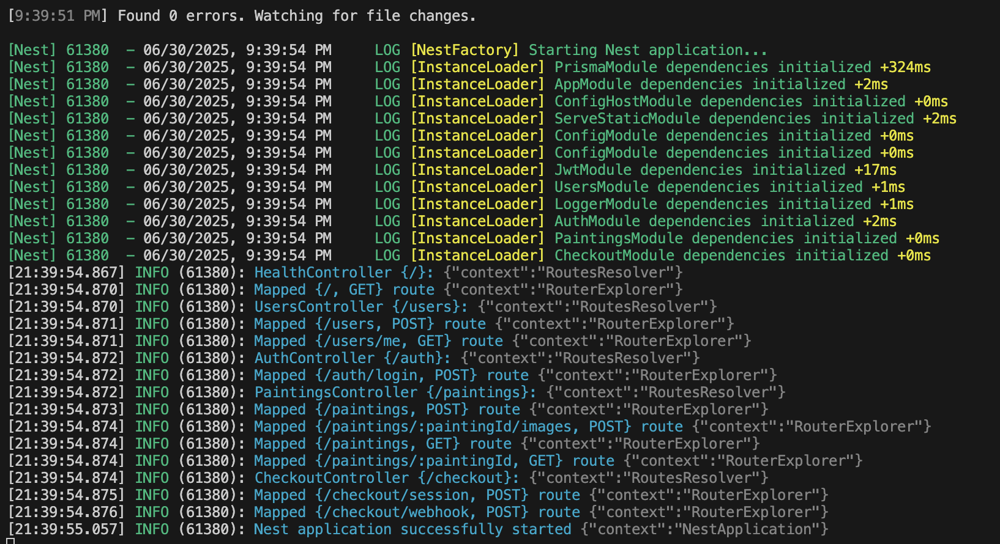
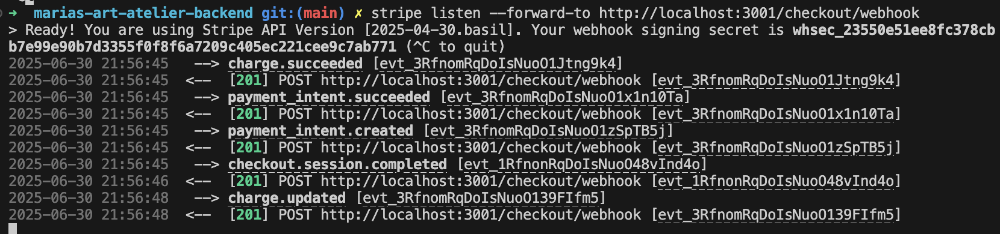
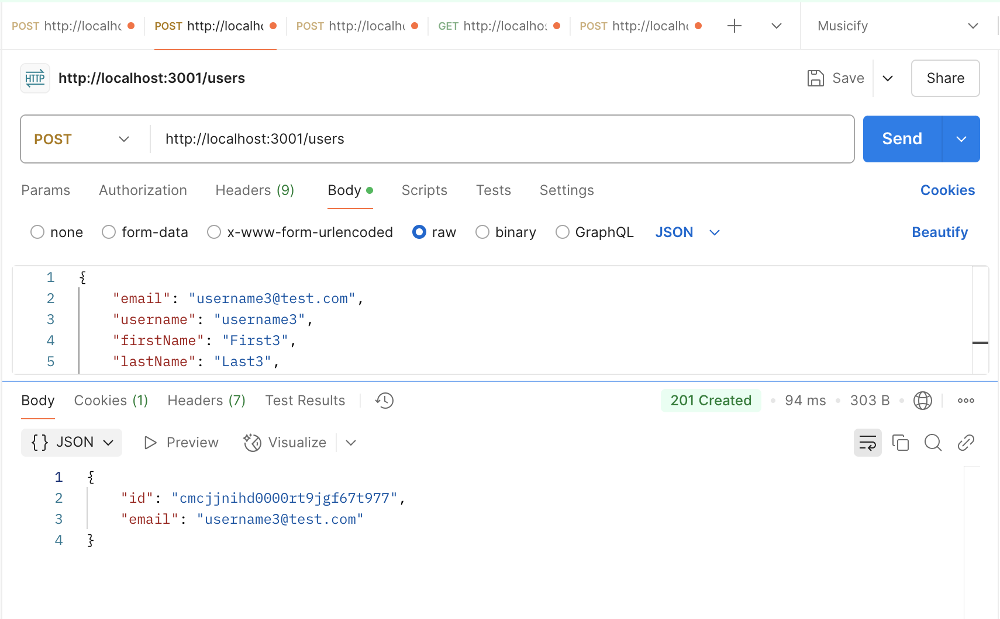
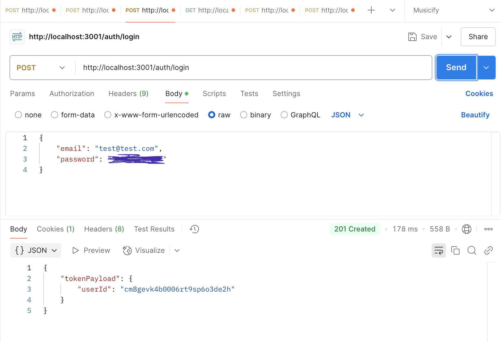
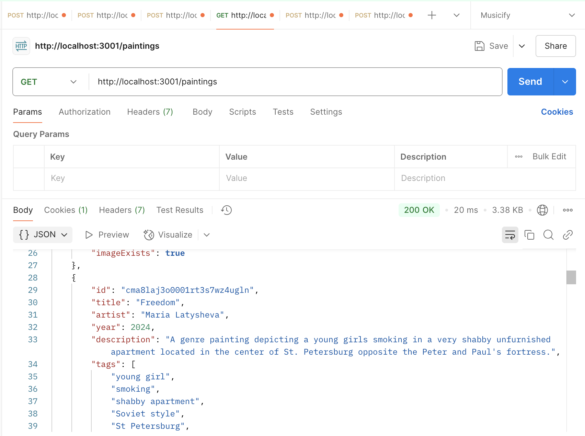
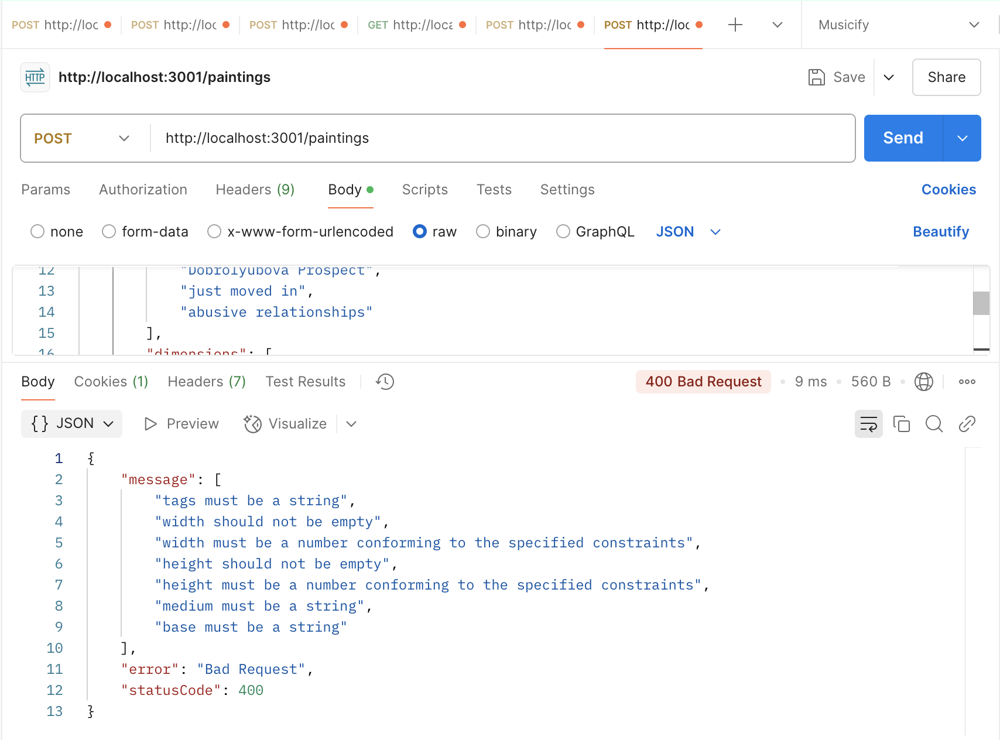
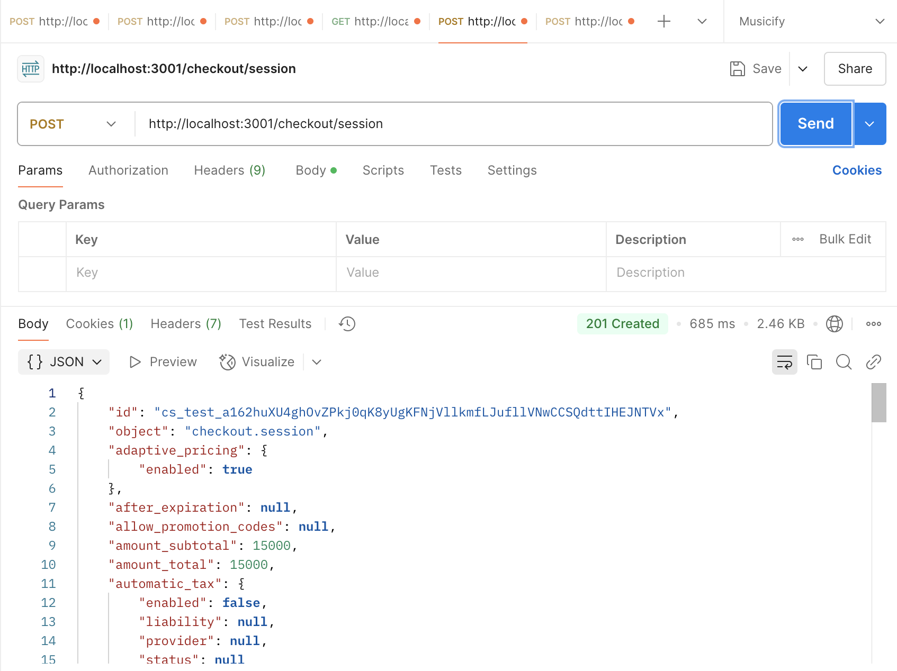
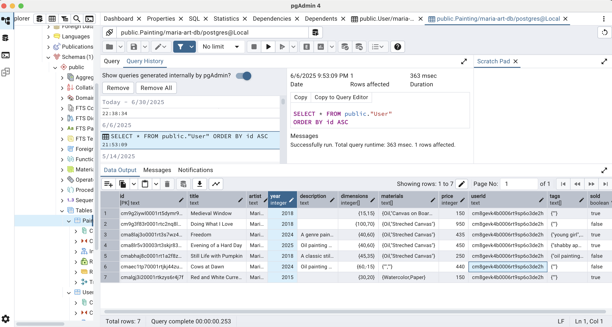

# Maria's Atelier Backend App

## Description

The app is built with `Nest.JS` framework 
It app provides the following backend functionality for the frontend `Maria's Atelier` app (https://github.com/mlatysheva/marias-art-atelier):
- CRUD functionality for creating, editing and deleting paintings 
- Cookie-based authentication using `passport` library
- Password protection using `bcrypt` library
- Integration with `Stripe` payment system
- Websocket connection based on `socket.io` library to update available paintings in real time after a successful Stripe purchase
- `Postgres` database to maintain users and paintings
- `Prisma ORM` to build and maintain Postgres database schemas 
- `class` transformer and validator to implement validation of database types

## Project setup

```bash
$ npm install
```

## Compile and run the project

```bash
# development
$ npm run start

# watch mode
$ npm run start:dev

# connect stripe checkout endpoint
$ stripe listen --forward-to http://localhost:3001/checkout/webhook
```

### Running the app in more detail

After installing the dependencies with `npm install` and starting the app with `npm run start:dev`, your terminal should be showing successful logs:



Then open a new terminal and type the following command:
`stripe listen --forward-to http://localhost:3001/checkout/webhook`

This will open a stripe webhook endpoint to listen for events coming from the Stripe checkout session:



Some endpoints tested with Postman:

Post request to `/users` to create a new user:



Post request to `/auth/login` to sign in a user:



Get request to `paintings` to get all available paintings:



Post request to `paintings` to add a new painting, with invalid entries:



Post request to Stripe events webhook:



The `paintings` table in PG Admin:


